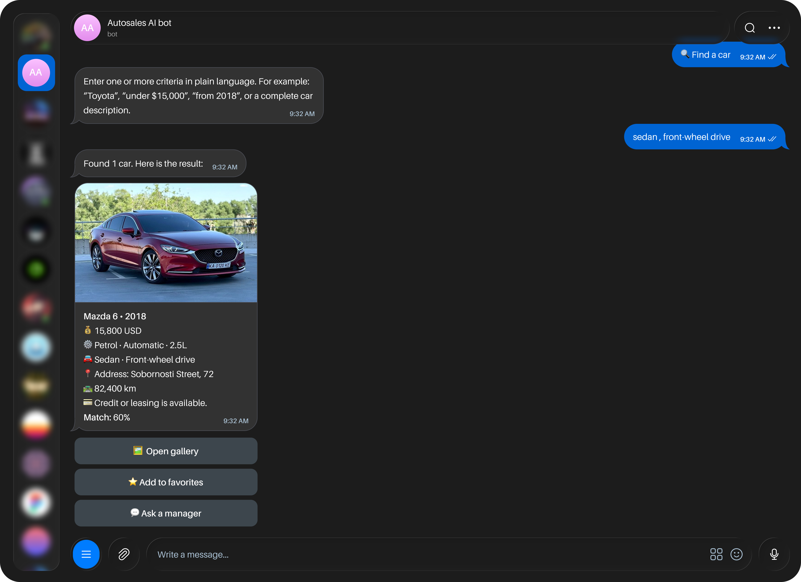
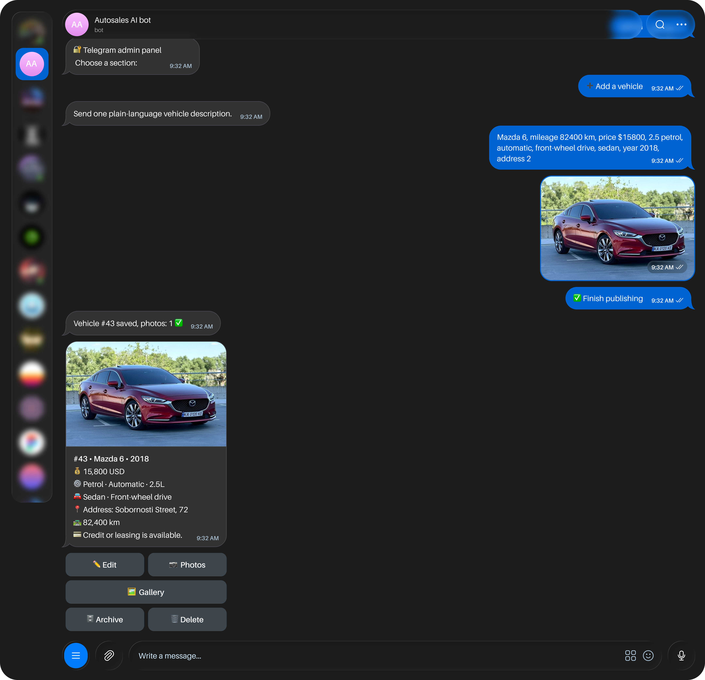
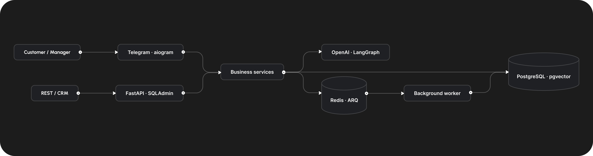

# AutoSales AI Bot

An asynchronous Telegram-first platform for car dealerships. Customers can search live
inventory in natural language, while managers can create and maintain structured vehicle
listings from a single message.

The project combines a bilingual Telegram experience, REST API, lightweight CRM, constrained
AI search, grounded knowledge-base answers, and background jobs in one Dockerized system.

## Product demo

### Customer: natural-language vehicle search

The assistant turns a request such as `sedan, front-wheel drive, under $18,000` into validated
filters, queries available inventory, and returns matching vehicle cards with gallery,
favorites, and manager contact actions.



### Manager: AI-assisted inventory creation

A manager can send one free-form description. The bot extracts vehicle data, asks only for
missing required fields, accepts up to 10 photos, selects a cover, and saves the final listing.




## Highlights

- Natural-language search by make, model, budget, year, mileage, body type, fuel,
  transmission, drivetrain, engine size, or EV power.
- Deterministic validation prevents values such as `19,800 USD` from being confused with a
  year or mileage and keeps mandatory constraints in SQL.
- AI-assisted listing creation with Ukrainian and English input, common typo handling, two
  dealership locations, structured output, and no raw prompt text in published cards.
- Customer catalog with pagination, cover images, galleries, favorites, and one-tap manager
  requests.
- Telegram admin workspace for listing CRUD, location filters, inventory statuses, photo
  management, lead ownership, archive, and permanent deletion.
- Immediate silent lead notifications and atomic “take ownership” actions to prevent multiple
  managers from contacting the same customer.
- LangGraph assistant routing inventory questions to constrained search and policy questions
  to grounded RAG.
- OpenAI integration with a deterministic offline fallback, so core search and inventory flows
  remain usable without an API key.
- Full Ukrainian and English localization for customer and manager interfaces.

## Architecture



The LLM extracts structured intent but does not decide inventory availability. Budget, year,
mileage, drivetrain, status, and other mandatory criteria become SQL filters before ranking.
Recommendations are built only from persisted vehicle records.

## Tech stack

| Area | Technology |
| --- | --- |
| API and bot | Python 3.12+, FastAPI, aiogram 3, Pydantic |
| AI | OpenAI Responses API, embeddings, LangGraph, rule-based fallback |
| Data | PostgreSQL, pgvector, SQLAlchemy 2, Alembic |
| Operations | Docker Compose, Redis, ARQ, structured logging |
| Admin and quality | SQLAdmin, pytest, Ruff, GitHub Actions |

## Quick start

Requirements: Docker Compose and a Telegram bot token. The OpenAI API key is optional.

```bash
cp .env.example .env
# Set TELEGRAM_BOT_TOKEN and replace the development secrets in .env
docker compose up --build -d
docker compose exec api python -m scripts.seed
```

Available services:

- Swagger UI: <http://localhost:8000/docs>
- Web CRM: <http://localhost:8000/admin>
- Health check: <http://localhost:8000/api/v1/health>
- MinIO console: <http://localhost:9001>

To enable the Telegram admin workspace, send `/id` to the bot, add the returned numeric ID to
`TELEGRAM_ADMIN_IDS` in `.env`, restart the bot, and send `/admin`.

```bash
docker compose up -d --force-recreate bot
docker compose logs --tail=100 bot
```

## Example flows

Customer search:

```text
Mazda sedan, front-wheel drive, automatic, under 18000 USD, from 2018
```

Manager listing input:

```text
Mazda 6, mileage 82400, price 15800 USD, engine 2.5 L, petrol,
automatic, front-wheel drive, sedan, 2018, location 1
```

The same search is available through the API:

```bash
curl -X POST http://localhost:8000/api/v1/ai/search \
  -H 'Content-Type: application/json' \
  -d '{"query":"sedan, front-wheel drive, under 18000 USD","language":"en"}'
```

## Reliability and safety

- Public responses expose a masked VIN instead of the full value.
- Customer contact details are excluded from AI prompts and embeddings.
- Archived or sold vehicles cannot appear in customer search results.
- Listing and lead changes are recorded in an audit log.
- Generated marketing content starts as a draft and requires staff approval.
- Lead creation is idempotent, and ownership is assigned atomically.
- AI failures return a user-facing error while the traceback remains available in service logs.

## Development

```bash
python -m venv .venv
source .venv/bin/activate
pip install -e '.[dev]'
ruff check .
ruff format --check .
pytest -q
```

Without `OPENAI_API_KEY`, the deterministic parser still supports prices, years, mileage,
body types, fuel types, transmissions, drivetrains, engine displacement, and EV power in kW.
Embeddings and generated AI copy are gracefully replaced with lexical ranking and structured
templates.

## Project structure

```text
autosales/
  ai/                structured extraction, hybrid search, RAG, LangGraph
  api/routers/       FastAPI endpoints
  services/          catalog, inventory, leads, notifications, audit
  telegram/          customer and manager aiogram flows
  i18n/locales/      Ukrainian and English resources and prompts
  models.py          SQLAlchemy domain model
  worker.py          ARQ background jobs
alembic/              database migrations
scripts/seed.py       local demo data
tests/                API, business-rule, AI, Telegram, and i18n tests
```

## Scope

This is a portfolio-ready MVP focused on dealership inventory and lead workflows. It does not
include payment processing, bank integrations, damage recognition, or automatic publishing to
third-party marketplaces. Production deployment should add TLS, rate limiting, managed secret
storage, backups, and an agreed media-retention policy.
